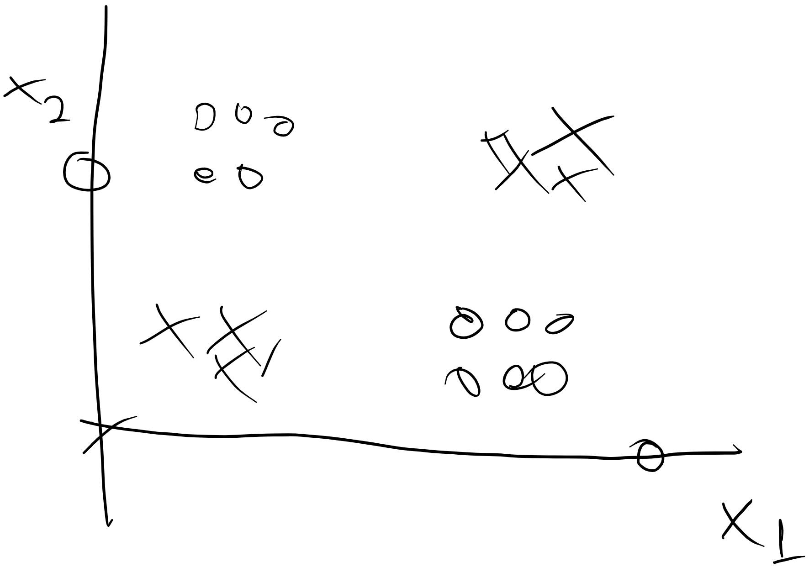

# Trying to train a non linear regression model without frameworks

The image above show the XOR Problem, that is not possible to just trace a straigth line and call it done

Above we have the AND e OR problem solved with only one neuron (perceptron)